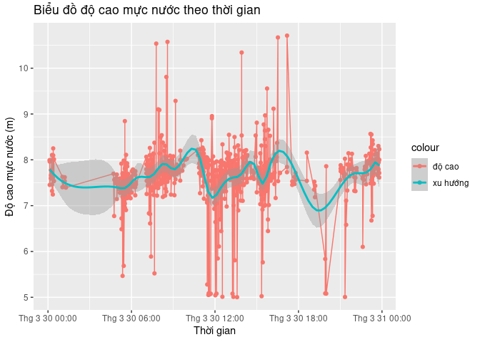
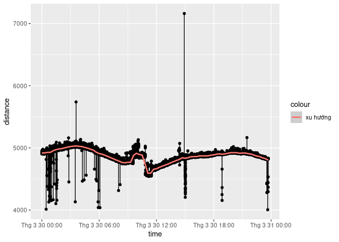
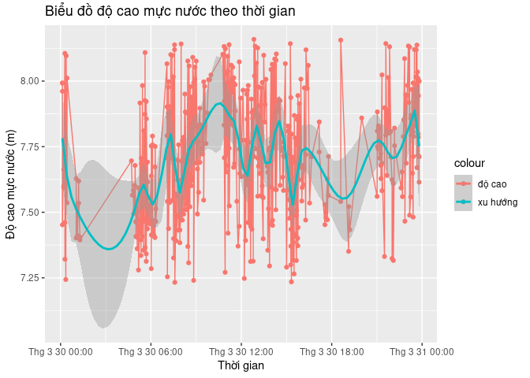
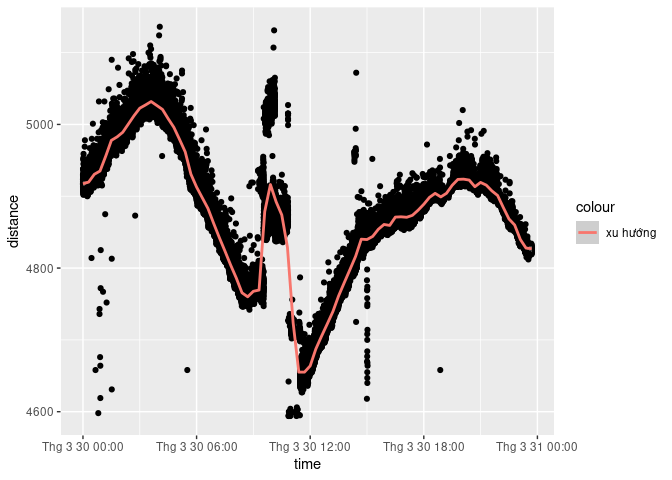
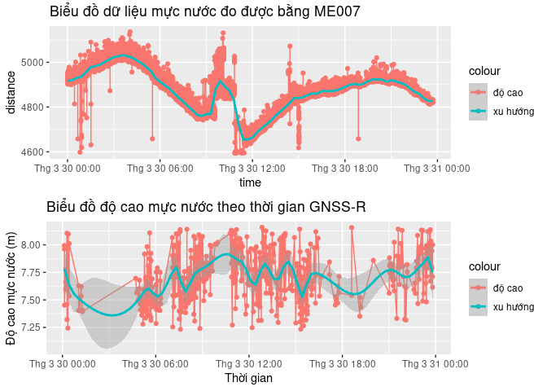

Report for GNSS-R
================

Đầu tiên nạp các thư viện cần thiết

``` r
library(readr)
library(ggplot2)
library(lubridate)
```

    ## 
    ## Attaching package: 'lubridate'

    ## The following objects are masked from 'package:base':
    ## 
    ##     date, intersect, setdiff, union

``` r
library(dplyr)
```

    ## 
    ## Attaching package: 'dplyr'

    ## The following objects are masked from 'package:stats':
    ## 
    ##     filter, lag

    ## The following objects are masked from 'package:base':
    ## 
    ##     intersect, setdiff, setequal, union

Đọc kết quả và chuyển timestamp về time

``` r
result = read.table("/home/fang/Working/GNSS-R CLI/output/result/Result.txt", header = T)
result$time = as_datetime(result$timestamp, origin = "1980-1-6")
nrow(result)
```

    ## [1] 651

Plot thử kết quả

``` r
ggplot(data = result, aes(x = time)) +
  ggtitle("Biểu đồ độ cao mực nước theo thời gian") +
  xlab("Thời gian") + ylab("Độ cao mực nước (m)") +
  geom_point(aes(y = height, col = "độ cao")) +
  geom_line(aes(y = height, col = "độ cao")) +
  geom_smooth(
    method = "lm",
    se = T,
    formula = y ~ splines::bs(x, 20),
    aes(y = height, col = "xu hướng")
  )
```

<!-- --> Đọc kết quả và
lọc với sensor ME007 lọc qua các giá trị nhiễu cực tiểu và cực đại

``` r
d_dat <- read_csv("../input/2203_3.csv", col_names = F) %>% as.data.frame()
```

    ## Rows: 83515 Columns: 6
    ## ── Column specification ────────────────────────────────────────────────────────
    ## Delimiter: ","
    ## dbl (6): X1, X2, X3, X4, X5, X6
    ## 
    ## ℹ Use `spec()` to retrieve the full column specification for this data.
    ## ℹ Specify the column types or set `show_col_types = FALSE` to quiet this message.

``` r
names(d_dat) =c("timestamp", "temp", "press","humid", "distance", "temp_s")
d_dat$time = lubridate::as_datetime(d_dat$timestamp, origin = "1980-1-6")
d_dat = dplyr::filter(d_dat, distance >= 4000 & distance <= 8000)

ggplot(d_dat, aes(x = time, y = distance)) +
  geom_point() +
  geom_line() +
  geom_smooth(
    method = "lm",
    se = T,
    formula = y ~ splines::bs(x, 100),
    aes(col = "xu hướng")
  )
```

<!-- -->

``` r
my.outlier <- function(x, c.name, coef, bias) {
  x = x[, c.name]
  out = x[, c.name[2]] %in% boxplot.stats(x[, c.name[2]], coef = coef)$out
  x = x[!out, ]
  spline =  lm(x[, c.name[2]] ~ splines::bs(x[, c.name[1]], 100))$fitted.values
  
  diff = abs(spline - x[, c.name[2]])
  out2 = diff <= bias
  return(x[out2, ])
}

result2 = my.outlier(result, c("time", "height"),0.5, 500)
ggplot(data = result2, aes(x = time)) +
  ggtitle("Biểu đồ độ cao mực nước theo thời gian") +
  xlab("Thời gian") + ylab("Độ cao mực nước (m)") +
  geom_point(aes(y = height, col = "độ cao")) +
  geom_line(aes(y = height, col = "độ cao")) +
  geom_smooth(
    method = "lm",
    se = T,
    formula = y ~ splines::bs(x, 30),
    aes(y = height, col = "xu hướng")
  )
```

<!-- --> Lọc giá trị
sensor me007

``` r
me007 = my.outlier(d_dat, c("time", "distance"), 2, 2000)

ggplot(me007, aes(x = time, y = distance)) +
  geom_point() +
  geom_smooth(
    method = "lm",
    se = T,
    formula = y ~ splines::bs(x, 100),
    aes(col = "xu hướng")
  )
```

<!-- --> khớp 2 giá trị
theo waveform

``` r
library(easyGgplot2)
ggplot2.multiplot(
  ggplot(me007, aes(x = time, y = distance)) +
  ggtitle("Biểu đồ dữ liệu mực nước đo được bằng ME007") +
  geom_point(aes(col = "độ cao")) +
  geom_line(aes(col = "độ cao"))+
  geom_smooth(
    method = "lm",
    se = T,
    formula = y ~ splines::bs(x, 100),
    aes(col = "xu hướng")
  ),
  ggplot(data = result2, aes(x = time)) +
  ggtitle("Biểu đồ độ cao mực nước theo thời gian GNSS-R") +
  xlab("Thời gian") + ylab("Độ cao mực nước (m)") +
  geom_point(aes(y = height, col = "độ cao")) +
  geom_line(aes(y = height, col = "độ cao")) +
  geom_smooth(
    method = "lm",
    se = T,
    formula = y ~ splines::bs(x, 30),
    aes(y = height, col = "xu hướng")
  ),
  cols = 1
)
```

<!-- -->
